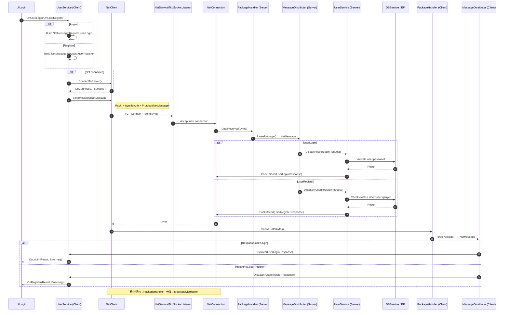

# 极世界 MMORPG（教学项目）

本项目包含 Unity 客户端与 .NET 服务器，以及一套共享的网络/协议库。本文提供快速上手、目录结构、网络协议与关键代码入口，所有代码引用均为相对链接，点击可直接跳转。

## 目录结构

- Client（Unity 客户端工程）
  - Assets/Game/Scripts：核心游戏与网络脚本
  - ProjectSettings：Unity 项目配置
- Server/GameServer（.NET 服务器工程）
  - GameServer：服务器源代码（控制台程序）
- Lib（共享库）
  - Common：日志、网络封包、消息分发等通用代码
  - Protocol：由 protobuf 生成的 C# 协议代码
  - proto：`message.proto` 协议定义
- Data：策划数据与工具

## 快速开始

### 启动服务器

1) 打开并配置数据库连接（默认 SQL Server，本地实例名可按需修改）：
- [Server/GameServer/GameServer/App.config](Server/GameServer/GameServer/App.config)

2) 用 Visual Studio 打开并运行服务器工程：
- [Server/GameServer/GameServer/GameServer.csproj](Server/GameServer/GameServer/GameServer.csproj)
- 入口： [Server/GameServer/GameServer/Program.cs](Server/GameServer/GameServer/Program.cs)
- 默认监听：127.0.0.1:8000（见 [Server/GameServer/GameServer/Network/NetService.cs](Server/GameServer/GameServer/Network/NetService.cs)）

3) 数据库初始化：如首次运行，请确保本机 SQL Server 中已有数据库 `ExtremeWorld`，或参考仓库中的 `Entities.edmx.sql` 初始化。

### 启动客户端

1) 用 Unity 打开工程：`Src/Client`

2) 加载场景并运行（示例场景）：
- [Client/Assets/Levels/Test.unity](Client/Assets/Levels/Test.unity)

3) 登录示例 UI：
- [Client/Assets/Game/Scripts/UI/UILogin.cs](Client/Assets/Game/Scripts/UI/UILogin.cs)
- 点击登录后，将通过 `UserService` 发送登录请求到服务器。

## 通信协议与封包

- 协议定义（protobuf）：
  - [Lib/proto/message.proto](Lib/proto/message.proto)
- 生成的 C# 协议代码：
  - [Lib/Protocol/message.cs](Lib/Protocol/message.cs)
- 封包格式：
  - 4 字节包长前缀 + Protobuf 序列化的 `NetMessage`
  - 打包与解包： [Lib/Common/Network/PackageHandler.cs](Lib/Common/Network/PackageHandler.cs)

## 关键代码入口

- 客户端网络：
  - 网络客户端： [Client/Assets/Game/Scripts/Network/NetClient.cs](Client/Assets/Game/Scripts/Network/NetClient.cs)
  - 用户服务： [Client/Assets/Game/Scripts/Services/UserService.cs](Client/Assets/Game/Scripts/Services/UserService.cs)
  - 启动流程（加载/日志初始化）： [Client/Assets/Game/Scripts/Core/LoadingManager.cs](Client/Assets/Game/Scripts/Core/LoadingManager.cs)
  - 消息分发（共享库）： [Lib/Common/Network/MessageDistributer.cs](Lib/Common/Network/MessageDistributer.cs)
  - 消息调度映射（自动生成）： [Lib/Common/Network/MessageDispatch.cs](Lib/Common/Network/MessageDispatch.cs)

- 服务器：
  - 入口： [Server/GameServer/GameServer/Program.cs](Server/GameServer/GameServer/Program.cs)
  - 服务器主控： [Server/GameServer/GameServer/GameServer.cs](Server/GameServer/GameServer/GameServer.cs)
  - 网络监听/连接：
    - [Server/GameServer/GameServer/Network/TcpSocketListener.cs](Server/GameServer/GameServer/Network/TcpSocketListener.cs)
    - [Server/GameServer/GameServer/Network/NetConnection.cs](Server/GameServer/GameServer/Network/NetConnection.cs)
    - [Server/GameServer/GameServer/Network/NetService.cs](Server/GameServer/GameServer/Network/NetService.cs)
  - 用户业务： [Server/GameServer/GameServer/Services/UserSerevice.cs](Server/GameServer/GameServer/Services/UserSerevice.cs)
  - 数据访问（EF）： [Server/GameServer/GameServer/Services/DBService.cs](Server/GameServer/GameServer/Services/DBService.cs)

## 登录/注册时序（Mermaid）

## 常见问题

- 服务器无法启动或端口占用：确认 8000 端口空闲，或在 [Server/GameServer/GameServer/Network/NetService.cs](Server/GameServer/GameServer/Network/NetService.cs) 调整端口，并同步修改客户端连接地址（见下条）。
- 客户端连接地址：当前客户端在 `UserService.ConnectToServer()` 写死为 `127.0.0.1:8000`
  - [Client/Assets/Game/Scripts/Services/UserService.cs](Client/Assets/Game/Scripts/Services/UserService.cs)
- 数据库连接失败：检查本机 SQL Server 实例与数据库名，修改 [Server/GameServer/GameServer/App.config](Server/GameServer/GameServer/App.config) 的 `ExtremeWorldEntities` 连接串。

—— 祝开发顺利！
