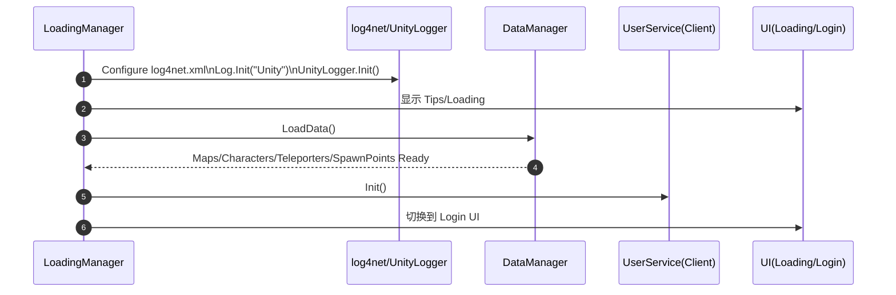
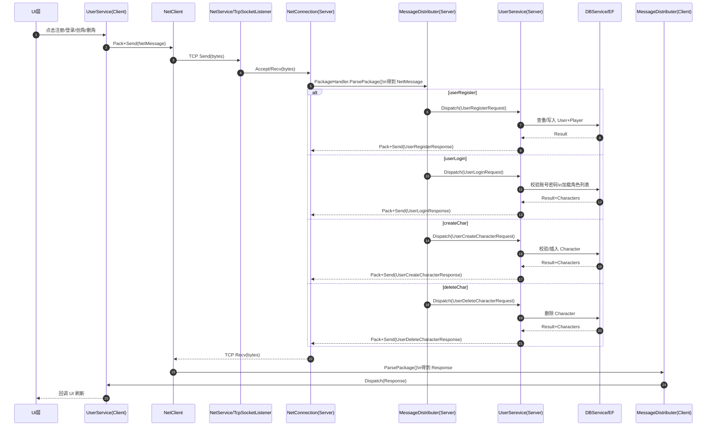
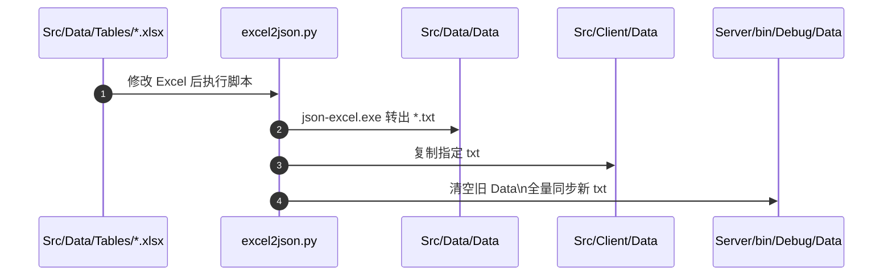

# Src 目录结构与关键时序

本文件只关注 `Src/` 下各子模块的代码结构与关键链路时序（Mermaid）。  
更完整的上手/规范/排查请看 `.codex/ONBOARDING.md` 与 `.codex/PROJECT_GUIDELINES.md`。

---

## 目录
- [1) Src 子模块结构](#1-src-子模块结构)
- [2) 关键模块说明](#2-关键模块说明)
- [3) 时序（Mermaid）](#3-时序mermaid)
- [4) 协议与数据链路](#4-协议与数据链路)

---

## 1) Src 子模块结构

```
Src/
├── Client/                         # Unity 客户端
│   ├── Assets/Game/Scripts/        # 核心脚本（Core/Network/Services/UI/Log 等）
│   ├── Assets/Levels/              # 场景
│   ├── Assets/Resources/           # 资源与 log4net.xml
│   └── Data/                       # 客户端运行时数据（*.txt）
│
├── Server/
│   └── GameServer/                 # 服务器解决方案根
│       └── GameServer/             # 服务器项目
│           ├── Network/            # TCP/连接/封包/消息分发
│           ├── Services/           # 业务网关（登录/注册/创角/删角）
│           ├── Entities/           # EF 实体与模型
│           ├── Utils/              # 时间/工具
│           └── bin/Debug/Data/     # 服务器运行时数据（转表同步）
│
├── Lib/                            # 双端共享库
│   ├── Common/                     # 日志/网络/单例等基础
│   ├── Protocol/                   # 由 proto 生成的 C# 协议
│   └── proto/message.proto         # 协议源文件
│
└── Data/                           # 策划数据与转表
    ├── Tables/*.xlsx               # Excel 源表
    ├── Data/*.txt                  # 转表产物（JSON 文本）
    └── excel2json.py               # 默认转表脚本
```

---

## 2) 关键模块说明

**客户端**
- `Core/LoadingManager.cs`：启动入口，初始化 log4net、加载策划数据、初始化 Services、切换 UI。
- `Core/DataManager.cs`：从 `Data/*.txt` 读取配置并缓存（Map/Character/Teleporter/SpawnPoint）。
- `Network/NetClient.cs`：TCP 客户端、收发循环、封包/拆包、消息分发。
- `Services/UserService.cs`：账号/角色相关请求发送与回包回调（对 UI 暴露统一接口）。
- `UI/*`：登录/注册/选角/弹窗等，订阅 `UserService` 回调，不直接处理网络包。

**服务器**
- `Program.cs`：服务器入口，初始化日志并启动 `GameServer`。
- `GameServer.cs`：组装 Network/DB/Services，启动主循环 Tick。
- `Network/NetService.cs`：监听 TCP、创建 `NetConnection`、把字节交给 `PackageHandler`。
- `Network/PackageHandler.cs`（共享库）：4 字节长度前缀 + Protobuf `NetMessage` 的打包/解包。
- `Services/UserSerevice.cs`：注册/登录/创角/删角网关；依赖 EF 写库。
- `Services/DBService.cs`：EF 上下文持有者（`Entities`）。

---

## 3) 时序（Mermaid）

### 3.1 客户端启动与数据加载



### 3.2 登录/注册/创角/删角（客户端 ↔ 服务器）



### 3.3 策划数据转表与同步



---

## 4) 协议与数据链路

**协议链路**

```
Src/Lib/proto/message.proto
  → Tools/genproto.cmd
  → Src/Lib/Protocol/message.cs
```
修改 proto 后必须同步提交生成的 `message.cs` 并重编双端。

**数据读取位置**

- 客户端：`DataManager.DataPath="Data/"` → 读取 `Src/Client/Data/*.txt`
- 服务器：运行目录 `bin/Debug` 下读取 `bin/Debug/Data/*.txt`

